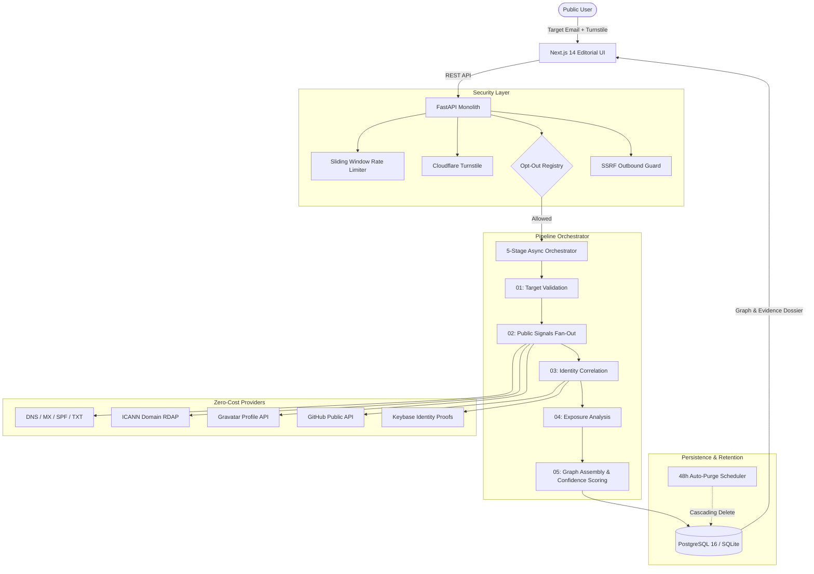

# YOUR-PRINTS

> **Digital Footprint Intelligence**  
> *Evidence Before Inference*

**YOUR-PRINTS** is a public-facing digital footprint intelligence platform designed to discover, normalize, correlate, and forensically present legitimate public information associated with an email address.

The platform enforces an uncompromising distinction between **what was observed**, **how strongly it couples to the target**, and **what identity claims can responsibly be asserted**.

---

## Core Philosophy

- **Evidence Before Inference**: Every finding is backed by an immutable evidentiary chain of custody. A technical observation (such as an MX hostname or common username handle) is never conflated with personal human identity.
- **Provider Policy Adherence**: Zero proxy rotation, zero anti-bot evasion. The platform respects upstream rate limits, access controls, and provider policies.
- **Zero Stolen Credentials**: Zero storage or indexing of password dumps, cleartext secrets, or exploit records.
- **Epistemological Integrity**: Confidence is evaluated across three transparent tiers (Observation Fidelity, Coupling Strength, Identity Claim Status) with dictionary-word collision penalties.
- **Privacy & Right-to-Erasure**: Automated 48-hour data retention with immediate user-triggered hard deletion and an exclusion registry for target opt-out.

---

## System Architecture



---

## Epistemological Confidence Model

YOUR-PRINTS rejects arbitrary pseudo-mathematical scoring in favor of a three-tier epistemological model:

```
┌─────────────────────────────────────────────────────────────┐
│ TIER A: SOURCE OBSERVATION RELIABILITY                      │
│   • DEFINITIVE: Authoritative DNS record or signed proof    │
│   • RELIABLE: Direct official API response (200 OK)         │
│   • UNCONFIRMED: Third-party mirror or secondary scrape     │
└──────────────────────────────┬──────────────────────────────┘
                               ▼
┌─────────────────────────────────────────────────────────────┐
│ TIER B: RELATIONSHIP COUPLING STRENGTH                      │
│   • DIRECT: Exact email match returned in payload           │
│   • CORROBORATED: Username match + matching name/domain     │
│   • UNCORROBORATED: Solely a common username match          │
└──────────────────────────────┬──────────────────────────────┘
                               ▼
┌─────────────────────────────────────────────────────────────┐
│ TIER C: IDENTITY CLAIM STATUS                               │
│   1. CONFIRMED ASSOCIATION (Exact email or signed proof)    │
│   2. STRONG MATCH (Username + independent corroboration)    │
│   3. POSSIBLE MATCH (Unique handle, no corroboration)       │
│   4. WEAK SIGNAL (Dictionary name collision penalty)        │
│   5. UNVERIFIED (Third-party historical mention)            │
└─────────────────────────────────────────────────────────────┘
```

---

## Project Structure

```text
YOUR-PRINTS/
├── backend/
│   ├── app/
│   │   ├── api/
│   │   │   └── v1/
│   │   │       ├── investigations.py  # Create, retrieve, evidence, delete
│   │   │       └── opt_out.py         # Permanent target exclusion registry
│   │   ├── core/
│   │   │   └── database.py            # Async SQLAlchemy engine & session
│   │   ├── domain/
│   │   │   ├── models.py              # Investigation, Entity, Relationship, Evidence
│   │   │   ├── schemas.py             # Pydantic v2 schemas
│   │   │   ├── confidence.py          # Three-tier confidence evaluator
│   │   │   └── validation.py          # RFC 5322 normalization & hashing
│   │   ├── engine/
│   │   │   ├── orchestrator.py        # 5-stage async pipeline runner
│   │   │   ├── normalizer.py          # Signal extraction & entity normalization
│   │   │   └── correlator.py          # Secondary pivot discovery & linking
│   │   ├── providers/
│   │   │   ├── base.py                # Abstract BaseProvider contract
│   │   │   ├── dns_provider.py        # DNS, MX, TXT, SPF inspection
│   │   │   ├── rdap_provider.py       # ICANN RDAP registrar metadata
│   │   │   ├── gravatar_provider.py   # Gravatar avatar & profile lookup
│   │   │   ├── github_provider.py     # GitHub public account inspector
│   │   │   ├── keybase_provider.py    # Keybase public identity proofs
│   │   │   └── registry.py            # Unified provider registry
│   │   └── security/
│   │       ├── ssrf_guard.py          # Outbound network IP validation
│   │       ├── rate_limit.py          # Sliding window rate limiter & target throttle
│   │       ├── turnstile.py           # Cloudflare Turnstile token validation
│   │       └── purge_task.py          # 48-hour retention auto-purge scheduler
│   └── tests/                         # Pytest test suite (67 unit & E2E tests)
├── frontend/
│   └── src/
│       ├── app/
│       │   ├── page.tsx               # Editorial landing page & entry prompt
│       │   ├── investigate/[id]/      # Graph, Entity Matrix, Timeline, Evidence
│       │   ├── methodology/page.tsx   # Epistemology & confidence whitepaper
│       │   └── privacy/page.tsx       # Live Opt-Out Portal & Retention Policy
│       ├── components/
│       │   ├── 3d/IdentityCore.tsx    # Three.js WebGL biometric signal core
│       │   ├── graph/NetworkGraph.tsx # D3.js interactive force-directed graph
│       │   └── evidence/EvidenceDrawer.tsx # Forensic provenance drawer
│       └── lib/
│           ├── api.ts                 # Type-safe API client
│           └── types.ts               # Shared TypeScript domain interfaces
├── docker-compose.yml                 # PostgreSQL, FastAPI, and Next.js orchestration
├── .env.example                       # Environment configuration template
└── README.md
```

---

## API Reference

| Method | Endpoint | Description |
| :--- | :--- | :--- |
| `POST` | `/api/v1/investigations` | Start a new investigation (Rate-limited, Turnstile-checked) |
| `GET` | `/api/v1/investigations/{id}` | Poll status / retrieve full intelligence dossier |
| `GET` | `/api/v1/investigations/{id}/evidence/{ev_id}` | Inspect raw observation provenance & rationale |
| `DELETE` | `/api/v1/investigations/{id}` | Immediate hard purge of investigation & graph nodes |
| `POST` | `/api/v1/opt-out` | Permanently exclude an email hash from future searches |
| `GET` | `/api/v1/opt-out/check` | Check if an email hash is in the opt-out registry |
| `GET` | `/api/health` | System health check and version telemetry |

---

## Local Development & Setup

### 1. Backend Setup
```bash
cd backend
python -m venv .venv
source .venv/bin/activate  # Or on Windows: .venv\Scripts\activate
pip install -e .

# Run all 67 test suites
pytest
```

### 2. Frontend Setup
```bash
cd frontend
npm install
npm run build
npm run dev
```
Open [http://localhost:3000](http://localhost:3000) to view the editorial landing page and 3D WebGL hero visualization.

### 3. Docker Deployment
```bash
cp .env.example .env
docker compose up --build
```

---

## License

MIT License. Designed and engineered for independent, evidence-based digital footprint intelligence research.
